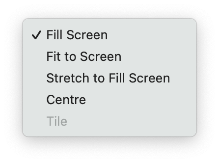

# macOS 12 Monterey

macOS 12 Monterey includes fundamental changes on how Apple-supplied Desktop images are sourced and where they are located. This has limited the scripts effectiveness. A Desktop image now needs to be downloaded manually before the script can set it as the Desktop picture. For more details read [Changes Since macOS 11 Big Sur](#changes-since-macos-11-big-sur).

## Purpose
Set a user's Desktop image in macOS 12 Monterey from the command line. See [Limitations](#limitations)

## Minimum Requirements

- macos 10.14 Mojave (macOS 12 Monterey required for the examples below to work)
- Bash 3.2 (Monterey ships with 3.2.57)
- Python 2.7 (Monterey ships with 2.7.16)

## Background
An explanation of how Desktop images appear to be managed by macOS since Mojave (10.14) can be found at [Setting the Desktop Image in macOS Mojave From the Command Line](https://www.tech-otaku.com/mac/setting-desktop-image-macos-mojave-from-command-line). While this article was written before the release of Monterey, the majority of the information is still relevant. 

## Instructions 

1. Download [macos-desktop-main.zip](https://github.com/tech-otaku/macos-desktop/archive/refs/heads/main.zip) 

1. Double-click `~/Downloads/macos-desktop-main.zip` in the Finder to unzip it (Safari may do this automatically)

1. Open the Terminal application in macOS

1. At a Terminal prompt:

    - type `cd ~/Downloads/macos-desktop-main` and press enter

    - type `chmod +x set-desktop.sh` and press enter to make the script executable

    - type `chmod +x options.py` and press enter to make the script executable

    - type `chmod +x Monterey\ Tests/set-desktop-monterey-tests.sh` and press enter to make the script executable

1. See the [Examples](#examples) section for using the `set-desktop.sh` script

1. See the [Valid Options](#valid-options) section for using the `options.py` script

1. See the [Tests](#tests) section for using the `set-desktop-monterey-tests.sh` script

## Usage
`./set-desktop.sh IMAGE`

`IMAGE` can be either 

- a pre-defined named option
- the path to an image file

See the [Valid Options](#valid-options) and [Examples](#examples) sections for more information.

## Examples

These examples use the Apple-supplied Deskop pictures that could otherwise be set via System Preferences. They are categorised and listed as they appear in the Desktop & Screensaver pane as of macOS 12.0 Monterey Beta 7 (21A5506j).

See [A Comparison of Apple-supplied Desktop Images Since macOS 10.14 Mojave](https://desktop.tech-otaku.com/)

### Desktop Pictures

#### Dynamic Desktop

Setting the image to *Dynamic* (e.g. The Beach Dynamic) ensures it changes throughout the day, based on your location.

###### Big Sur Dynamic <sup>**1**</sup>
`./set-desktop.sh big-sur`

###### Big Sur Light (Still) <sup>**1**</sup>
`./set-desktop.sh big-sur-light`

###### Big Sur Dark (Still) <sup>**1**</sup>
`./set-desktop.sh big-sur-dark`

###### Catalina Dynamic <sup>**1**</sup>
`./set-desktop.sh catalina`

###### Catalina Light (Still) <sup>**1**</sup>
`./set-desktop.sh catalina-light`

###### Catalina Dark (Still) <sup>**1**</sup>
`./set-desktop.sh catalina-dark`

###### The Cliffs Dynamic <sup>**1**</sup>
`./set-desktop.sh cliffs`

###### The Cliffs Light (Still) <sup>**1**</sup>
`./set-desktop.sh cliffs-light`

###### The Cliffs Dark (Still) <sup>**1**</sup>
`./set-desktop.sh cliffs-dark`

###### The Lake Dynamic <sup>**1**</sup>
`./set-desktop.sh lake`

###### The Lake Light (Still) <sup>**1**</sup>
`./set-desktop.sh lake-light`

###### The Lake Dark (Still) <sup>**1**</sup>
`./set-desktop.sh lake-dark`

###### The Desert Dynamic <sup>**1**</sup>
`./set-desktop.sh desert`

###### The Desert Light (Still) <sup>**1**</sup>
`./set-desktop.sh desert-light`

###### The Desert Dark (Still) <sup>**1**</sup>
`./set-desktop.sh desert-dark`

###### The Beach Dynamic <sup>**1**</sup>
`./set-desktop.sh beach`

###### The Beach Light (Still) <sup>**1**</sup>
`./set-desktop.sh beach-light`

###### The Beach Dark (Still) <sup>**1**</sup>
`./set-desktop.sh beach-dark`

###### Solar Gradients <sup>**1**</sup>
`./set-desktop.sh solar`

##### Light and Dark Desktop

Setting the image to *Automatic* (e.g. Peak Automatic) ensures it conforms to the *Light*, *Dark* or *Auto* setting in **System Preferences** > **General** > **Appearance**.

###### macOS Graphic Automatic
`./set-desktop.sh graphic`

###### macOS Graphic Light (Still)
`./set-desktop.sh light`

###### macOS Graphic Dark (Still)
`./set-desktop.sh dark`

###### Hello Green Automatic
`./set-desktop.sh green`

###### Hello Green Light (Still)
`./set-desktop.sh green-light`

###### Hello Green Dark (Still)
`./set-desktop.sh green-dark`

###### Hello Yellow Automatic
`./set-desktop.sh yellow`

###### Hello Yellow Light (Still)
`./set-desktop.sh yellow-light`

###### Hello Yellow Dark (Still)
`./set-desktop.sh yellow-dark`

###### Hello Orange Automatic
`./set-desktop.sh orange`

###### Hello Orange Light (Still)
`./set-desktop.sh orange-light`

###### Hello Orange Dark (Still)
`./set-desktop.sh orange-dark`

###### Hello Pink Automatic
`./set-desktop.sh pink`

###### Hello Pink Light (Still)
`./set-desktop.sh pink-light`

###### Hello Pink Dark (Still)
`./set-desktop.sh pink-dark`

###### Hello Purple Automatic
`./set-desktop.sh purple`

###### Hello Purple Light (Still)
`./set-desktop.sh purple-light`

###### Hello Purple Dark (Still)
`./set-desktop.sh purple-dark`

###### Hello Blue Automatic
`./set-desktop.sh blue`

###### Hello Blue Light (Still)
`./set-desktop.sh blue-light`

###### Hello Blue Dark (Still)
`./set-desktop.sh blue-dark`

###### Hello Silver Automatic
`./set-desktop.sh silver`

###### Hello Silver Light (Still)
`./set-desktop.sh silver-light`

###### Hello Silver Dark (Still)
`./set-desktop.sh silver-dark`

###### Big Sur Graphic Automatic
`./set-desktop.sh big-sur-graphic`

###### Big Sur Graphic Light (Still)
`./set-desktop.sh big-sur-graphic-light`

###### Big Sur Graphic Dark (Still)
`./set-desktop.sh big-sur-graphic-dark`

###### Peak Automatic <sup>**1**</sup>
`./set-desktop.sh peak`

###### Peak Light (Still) <sup>**1**</sup>
`./set-desktop.sh peak-light`

###### Peak Dark (Still) <sup>**1**</sup>
`./set-desktop.sh peak-dark`

###### Tree Automatic <sup>**1**</sup>
`./set-desktop.sh tree`

###### Tree Light (Still) <sup>**1**</sup>
`./set-desktop.sh tree-light`

###### Tree Dark (Still) <sup>**1**</sup>
`./set-desktop.sh tree-dark`

###### Valley Automatic <sup>**1**</sup>
`./set-desktop.sh valley`

###### Valley Light (Still) <sup>**1**</sup>
`./set-desktop.sh valley-light`

###### Valley Dark (Still) <sup>**1**</sup>
`./set-desktop.sh valley-dark`

###### Dome Automatic <sup>**1**</sup>
`./set-desktop.sh dome`

###### Dome Light (Still) <sup>**1**</sup>
`./set-desktop.sh dome-light`

###### Dome Dark (Still) <sup>**1**</sup>
`./set-desktop.sh dome-dark`

###### Iridescence Automatic <sup>**1**</sup>
`./set-desktop.sh iridescence`

###### Iridescence Light (Still) <sup>**1**</sup>
`./set-desktop.sh iridescence-light`

###### Iridescence Dark (Still) <sup>**1**</sup>
`./set-desktop.sh iridescence-dark`

##### Desktop Pictures

###### Big Sur Mountains <sup>**1**</sup>
`./set-desktop.sh mountains`

###### Big Sur Aerial <sup>**1**</sup>
`./set-desktop.sh aerial`

###### Big Sur Horizon <sup>**1**</sup>
`./set-desktop.sh horizon`

###### Big Sur Coastline <sup>**1**</sup>
`./set-desktop.sh coastline`

###### Big Sur Shore Rocks <sup>**1**</sup>
`./set-desktop.sh shore`

###### Big Sur Water's Edge <sup>**1**</sup>
`./set-desktop.sh edge`

###### Big Sur Road <sup>**1**</sup>
`./set-desktop.sh road`

###### Big Sur Night Succulents <sup>**1**</sup>
`./set-desktop.sh succulents`

###### Big Sur Night Grasses <sup>**1**</sup>
`./set-desktop.sh grasses`

###### Catalina Coast <sup>**1**</sup>
`./set-desktop.sh coast`

###### Catalina Evening <sup>**1**</sup>
`./set-desktop.sh evening`

###### Catalina Rock <sup>**1**</sup>
`./set-desktop.sh rock`

###### Catalina Shoreline <sup>**1**</sup>
`./set-desktop.sh shoreline`

###### Catalina Clouds <sup>**1**</sup>
`./set-desktop.sh clouds`

###### Catalina Silhouette <sup>**1**</sup>
`./set-desktop.sh silhouette`

###### Catalina Sunset <sup>**1**</sup>
`./set-desktop.sh sunset`

###### Light Stream Red <sup>**1**</sup>
`./set-desktop.sh stream-red`

###### Light Stream Blue <sup>**1**</sup>
`./set-desktop.sh stream-blue`

###### Light Stream Pink <sup>**1**</sup>
`./set-desktop.sh stream-pink`

###### Light Stream Green <sup>**1**</sup>
`./set-desktop.sh stream-green`

### Colours

###### Black
`./set-desktop.sh "/System/Library/Desktop Pictures/Solid Colors/Black.png"`

###### Blue Violet
`./set-desktop.sh "/System/Library/Desktop Pictures/Solid Colors/Blue Violet.png"`

###### Cyan
`./set-desktop.sh "/System/Library/Desktop Pictures/Solid Colors/Cyan.png"`

###### Dusty Rose
`./set-desktop.sh "/System/Library/Desktop Pictures/Solid Colors/Dusty Rose.png"`

###### Electric Blue
`./set-desktop.sh "/System/Library/Desktop Pictures/Solid Colors/Electric Blue.png"`

###### Gold 2
`./set-desktop.sh "/System/Library/Desktop Pictures/Solid Colors/Gold 2.png"`

###### Gold
`./set-desktop.sh "/System/Library/Desktop Pictures/Solid Colors/Gold.png"`

###### Ocher
`./set-desktop.sh "/System/Library/Desktop Pictures/Solid Colors/Ocher.png"`

###### Plum
`./set-desktop.sh "/System/Library/Desktop Pictures/Solid Colors/Plum.png"`

###### Red Orange
`./set-desktop.sh "/System/Library/Desktop Pictures/Solid Colors/Red Orange.png"`

###### Rose Gold
`./set-desktop.sh "/System/Library/Desktop Pictures/Solid Colors/Rose Gold.png"`

###### Silver
`./set-desktop.sh "/System/Library/Desktop Pictures/Solid Colors/Silver.png"`

###### Soft Pink
`./set-desktop.sh "/System/Library/Desktop Pictures/Solid Colors/Soft Pink.png"`

###### Space Grey Pro
`./set-desktop.sh "/System/Library/Desktop Pictures/Solid Colors/Space Gray Pro.png"`

###### Space Grey
`./set-desktop.sh "/System/Library/Desktop Pictures/Solid Colors/Space Gray.png"`

###### Stone
`./set-desktop.sh "/System/Library/Desktop Pictures/Solid Colors/Stone.png"`

###### Teal
`./set-desktop.sh "/System/Library/Desktop Pictures/Solid Colors/Teal.png"`

###### Turquoise Green
`./set-desktop.sh "/System/Library/Desktop Pictures/Solid Colors/Turquoise Green.png"`

###### Yellow
`./set-desktop.sh "/System/Library/Desktop Pictures/Solid Colors/Yellow.png"`
<br />
<br />
<sup>**1**</sup> Requires the image to be downloaded first via System Preferences.

#### Other

###### Default
`./set-desktop.sh default`

###### General
`./set-desktop.sh "/path/to/desktop/image.jpg"`

## Error Messages

###### Not running macOS 10.14 Mojave or later
`ERROR: For use with macOS 10.14 Mojave or later.`

###### No Desktop image passed on the command line
`ERROR: No image was specified.`

###### Supplied Desktop image is a file that doesn't exist
`ERROR: </path/to/desktop/image.jpg> doesn't exist.`

###### Supplied Desktop image file hasn't been downloaded
`ERROR: Please download <desktop picture> via System Preferences first, then re-run this script.`

###### Invalid option passed on the command line
`ERROR: <option> is not a valid option.`

###### Attempt to reset a database other than desktoppicture.db to the default
`ERROR: The 'default' option is only appropriate when the database is ~/Library/Application Support/Dock/desktoppicture.db`

###### Possible dual-monitor environment detected
`ERROR: This script should not be used in a dual-monitor environment.`

###### Two or more Desktops (Spaces) detected
`ERROR: This script should not be used when multiple Desktops (Spaces) are configured.`


## Limitations
Works only with a single Desktop (Space) in a single-display environment.

__Not for use with multiple Desktops (Spaces) or in a dual-display environment.__


## Valid Options

All valid options and their corresponding data are stored in the file `options.json`. To list these options for Monterey use the following:

- unsorted in the order they appear in `options.json` use `./options.py --version monterey`

- sorted by `category` use `./options.py --version monterey --sort category`

- sorted by `name` use `./options.py --version monterey --sort name`

- sorted by `option` use `./options.py --version monterey --sort option`

## Tests

The `set-desktop-monterey-tests.sh` script in the `Monterey Tests` directory executes `set-desktop.sh` a given number of times (the default is 5 if omitted), each time passing it an option or filename randomly selected from `desktop-images.txt`.

The intention is to document the state of the `data` and `preferences` tables in the `desktoppicture.db` database after each iteration. Output is written to `set-desktop-monterey-tests.txt`

To change the Desktop picture 100 times, `cd` into the `Monterey Tests` directory and type `./set-desktop-monterey-tests.sh 100`

## Changes Since macOS 11 Big Sur

macOS Monterey has introduced some fundamental changes to where Desktop pictures are located and how they are initially created. This has provided some [challenges](#challenges) in changing the `set-desktop.sh` script to support these changes.

### Changes in macOS Monterey Developer Beta 1 [21A5248p]

#### New Desktop Picture Images

* Only one new Desktop picture named **macOS Graphic** is included and is now the default.

* In System Preferences > Desktop & Screensaver > Desktop it is the first thumbnail in the Light and Dark Desktop category. 
    
* There are options for *Automatic*, *Light (Still)* and *Dark* (Still).

* The image file is `/System/Library/Desktop Pictures/macOS Graphic.heic`


#### New `.madesktop` Files

* With the exception of `macOS Graphic.heic` and  `Big Sur Graphic.heic` all images with a `.heic` extension in `/System/Library/Desktop Pictures/` that existed in Big Sur and earlier releases of macOS have been replaced by files with a  `.madesktop` extension e.g. `Catalina.heic` is now `Catalina.madesktop`.

* Each file with a `.madesktop` extension is an XML file containing amongst other data the path to a thumbnail image that is displayed in System Preferences > Desktop & Screensaver > Desktop.

```
<?xml version="1.0" encoding="UTF-8"?>
<!DOCTYPE plist PUBLIC "-//Apple//DTD PLIST 1.0//EN" "http://www.apple.com/DTDs/PropertyList-1.0.dtd">
<plist version="1.0">
<dict>
	<key>mobileAssetID</key>
	<string>Catalina</string>
	<key>thumbnailPath</key>
	<string>/System/Library/Desktop Pictures/.thumbnails/Catalina.heic</string>
    <key>isDynamic</key>
    <true/>
    <key>isSolar</key>
    <true/>
    <key>width</key>
    <real>6016.0</real>
    <key>height</key>
    <real>6016.0</real>
</dict>
</plist>
```
---
<br />

#### Desktop Picture Image Files do not Exist on Fresh Install / Location Changed

* With the exception of `macOS Graphic.heic` and  `Big Sur Graphic.heic` the full size images used for the Desktop pictures no longer exist on a fresh install of macOS Monterey. This is evident from the download icon on each of the Desktop picture thumbnails in System Preferences > Desktop & Screensaver > Desktop. 

* The Desktop picture can only be set to the selected `.heic` image after it has been explicitly downloaded by clicking the download icon.

* The image is no longer located in the `/System/Library/Desktop Pictures/` directory as in previous macOS versions, but a zip file containing the image is downloaded to the `/System/Library/AssetsV2/com_apple_MobileAsset_DesktopPicture/` directory. 

* The URL of the zip file and the name and location of the directory created when it's expanded are stored in  `/System/Library/AssetsV2/com_apple_MobileAsset_DesktopPicture/com_apple_MobileAsset_DesktopPicture.xml`. 

```
<dict>
    ....
    <key>DesktopPictureID</key>
    <string>Catalina</string>
    ....
    <key>__BaseURL</key>
    <string>http://updates-http.cdn-apple.com/2021/mobileassets/071-34545/7E2884C0-2F21-4028-B22E-2EA162B35135/</string>
    ....
    <key>__RelativePath</key>
    <string>com_apple_MobileAsset_DesktopPicture/28e590448a1795ffd7d8ae9c9f826ceedd9696a2.zip</string>
    ....
</dict>
```

* Using `Catalina.heic` as an example:
    * the zip file is located at `__BaseURL` + `__RelativePath`
    * when unzipped, a parent folder named after the zip file is created 

```
/
|-- System/
    |-- Library/
        |-- AssetsV2/
            |-- com_apple_MobileAsset_DesktopPicture/
                |-- 28e590448a1795ffd7d8ae9c9f826ceedd9696a2/ <--- Created when zip file expanded
                    |-- AssetData//
                        |-- Catalina.heic                     <--- Desktop picture
                    |-- Info.plist
                    |-- META-INF/
                        |-- com.apple.ZipMetadata.plist
```

#### Challenges

If the `set-desktop.sh` script is used to set the Desktop picture to say *Catalina Dynamic* and `Catalina.heic` doesn't exist, it first needs to be downloaded and placed in the correct directory (see above). This would be fairly easy to achieve if it weren't for System Integrity Protection (SIP) which prevents the `/System` directory from being written to. 

The options for the script are:

1. Disable SIP before running the script. 

    **Rejected**: SIP is enabled by default and disabling it is not a trivial matter nor perhaps desirable. Even if it were, disabling SIP is not something the script would be able to do as it requires considerable user intervention.

2. Have the script download and place missing Desktop picture image files in a writable directory.

    The script can use existing Desktop picture image files in the `/System/Library/AssetsV2/com_apple_MobileAsset_DesktopPicture/` directory and download and place missing Desktop picture image files in a newley-created writable directory say `~/Library/Application Support/AssetsV2/com_apple_MobileAsset_DesktopPicture/Dock`. This is the location of `desktoppicture.db`, the database that stores the current Desktop picture. 

    **Rejected**: This *does* work, but with one big caveat. After the script has set the Desktop picture to an `.heic` image in a location other than the `/System/Library/AssetsV2/com_apple_MobileAsset_DesktopPicture/` directory the dropdown menu for the selected image in System Preferences > Desktop & Screensaver > Desktop shows...

    

    However, for Desktop pictures in the *Dynamic Desktop* category the options should be *Dynamic*, *Light (Still)* and *Dark (Still)*. For the *Light and Dark Desktop* category, the *Dynamic* option is replaced by *Automatic*.   

3. Have the script use existing Desktop picture image files in the `/System/Library/AssetsV2/com_apple_MobileAsset_DesktopPicture/` and prompt the user to download any missing image file via System Preferences > Desktop & Screensaver > Desktop.

    **This is how the current version of the script functions.**

### Changes in macOS Monterey Developer Beta 2 [21A5268h]

#### New Desktop Picture Images

* New Desktop pictures included in the Light and Dark Desktop Category in System Preferences > Desktop & Screensaver > Desktop:
    * Hello Green (hello Green.heic)
    * Hello Yellow (hello Yellow.heic)
    * Hello Orange (hello Orange.heic)
    * Hello Pink (hello Red.heic)
    * Hello Purple (hello Purple.heic)
    * Hello Blue (hello Blue.heic)
    * Hello Silver (hello Grey.heic)
    
* Like other Desktop pictures in the Light and Dark Desktop category, there are options for *Automatic*, *Light (Still)* and *Dark* (Still).

* The image files are located in the `/System/Library/Desktop Pictures/` directory and do not need to be downloaded via System Preferences. These files have existed in this directory since Big Sur and the release of the new 24" iMac, but this is the first time thay've been included as options in System Preferences.

---

Back to [TOC](README.md#table-of-contents-toc)